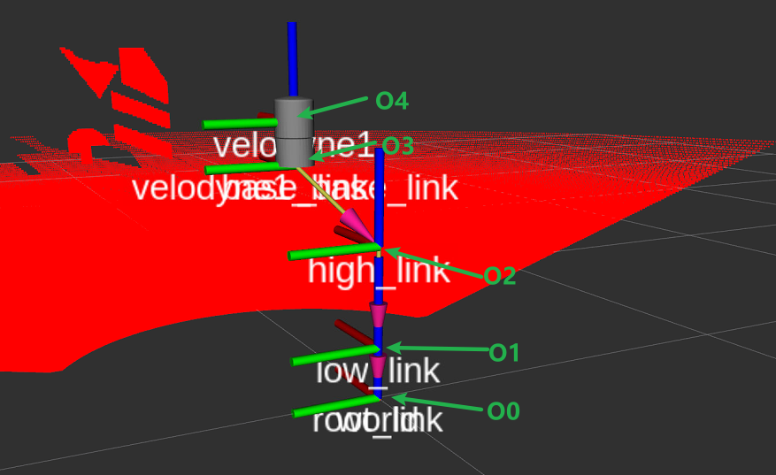

# gimbal_structure_simulation
这是仿照类似U型号的云台结构的仿真，也就是二轴云台结构。
# 一些说明

在这里，我们采用右手坐标系，朝前为x，朝左为y，朝上为z。

O0表示云台底部中心，O1表示云台第一轴中心，负责控制云台绕着Z轴转动，也就是水平方向的旋转。O2表示云台第二轴中心，负责控制云台绕着Y轴转动，也就是垂直方向的旋转。

O3表示雷达底座的中心，O4表示雷达光芯位置。

**为了模拟部分现实情况，也就是雷达安装的时候，雷达光芯不会直接安装在O0-O1-O2这条轴上，而是会和O2有一定的偏移。**

这里使用的雷达是velodyne HDL-32E仿真。

在初始的状态下，各个坐标系存在着以下相对的位置关系。
O1-O0（0 0 0.115）

O2-O1（0 0 0.222）

O3-O2（0.2 0.1 0.15）

O4-O3（0 0 0.091）

你也可以根据自己的需求进行调整。

TODO：
- 你需要修改`worlds/signboard.world`中的`uri`的路径为你自己的路径
